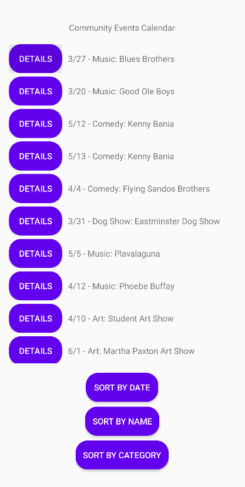
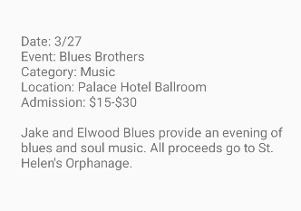

# 📅 Events Calendar (Android)

[]()
[]()
[]()

A simple, free-to-use Android app that displays **community events** from a CSV file bundled in `assets/`.  
Browse events in a fast list, **sort by Date / Name / Category**, and tap into a **detail screen** for the full description.

> Built with **Java**, **RecyclerView**, and a lightweight **CSV parser**.  
> CSV format: `category,name,location,month,day,admission price,description`

---

## ✨ Features
- 📂 Reads events from `assets/events.csv` (no network required)
- 🧭 Sort controls: **Date**, **Name**, **Category**
- 📝 Detail screen for long descriptions (`DetailActivity`)
- ⚡ Efficient list rendering via **RecyclerView**
- 🧹 Minimal dependencies; easy to customize or extend

---

## 📸 Screens

<p align="center">
  
  
</p>


```html
<p align="center">
  
  
</p>

🧱 Project Structure (key files)

app/
├── src/main/
│   ├── java/a5/calendar/
│   │   ├── MainActivity.java          # List + sort buttons
│   │   ├── DetailActivity.java        # Shows full description
│   │   ├── controller/
│   │   │   └── CSVParser.java         # Reads assets/events.csv
│   │   ├── model/
│   │   │   └── Event.java             # POJO for events
│   │   └── view/
│   │       └── EventAdapter.java      # RecyclerView adapter (not shown here)
│   ├── assets/
│   │   └── events.csv                 # Your events data
│   ├── res/layout/
│   │   ├── activity_main.xml          # RecyclerView + buttons
│   │   ├── activity_detail.xml        # TextView for details
│   │   └── item_event.xml             # Row layout (title/meta/buttons)
│   └── AndroidManifest.xml
└── build.gradle

🧾 CSV Format
Each line is:

category,name,location,month,day,admission price,description

Example:

Festival,Spring Art Fair,Downtown Park,4,22,Free,Over 100 local artists with live music and food trucks.
Music,Open Mic Night,The Lantern,5,3,$5,Acoustic and poetry night; sign-ups at 6:30 PM.
The parser uses line.split(",", 7) to preserve commas inside the description.

🚀 Getting Started
1) Clone

git clone https://github.com/LovelyShades/Calender_Android_App.git
2) Open in Android Studio
File → Open… and select the project folder.

Let Gradle sync.

3) Run
Use an emulator (AVD) or physical device.

Click Run ▶ in Android Studio.

Note: The emulator behaves like a real phone and keeps installed apps between runs.
If you see older test apps, uninstall them or use AVD Manager → Wipe Data for a clean state.

🕹️ Usage
Launch the app → events are loaded from assets/events.csv.

Tap Sort by Date / Name / Category to reorder.

Tap an event’s Details button to open the DetailActivity with the full description.

🛠️ Implementation Notes
CSVParser.java (controller)
Opens assets/events.csv via context.getAssets().open("events.csv")

Splits each line into 7 fields; trims and maps to an Event.

Event.java (model)
Immutable POJO with:

category, name, location, month, day, admissionPrice, description.

MainActivity.java
Loads and logs events.

Binds RecyclerView with EventAdapter.

Wire-up sort buttons:

Date: month → day → category → name

Name: name → month → day → category

Category: category → month → day → name

DetailActivity.java
Reads EXTRA_EVENT_DETAIL from Intent and shows it in a TextView.

🔧 Customization
Change CSV file name
Update the parser path if you rename events.csv.

Add fields
Add columns to the CSV and extend Event, adapter binding, and layouts.

Internationalization / Date
Replace integer month/day with real LocalDate or formatted strings as needed.

Filtering & Search
Add a SearchView or text box and filter the adapter list.

✅ Requirements
Android Studio (latest stable)

A device or emulator with a recent API level (works fine on standard images)

No special permissions required

🧪 Testing Tips (optional)
Provide a small events.csv fixture in assets/ for instrumentation/UI tests.

Validate bad rows by temporarily logging NumberFormatException or token length.

📄 License (Free Use)
This project is licensed under the MIT License to enable free use in learning, personal, and commercial contexts.

MIT License

Copyright (c) 2025 Alanna Matundan

Permission is hereby granted, free of charge, to any person obtaining a copy
...


👩‍💻 Author
Alanna Matundan
For questions/collaboration: rosealanna18@gmail.com
